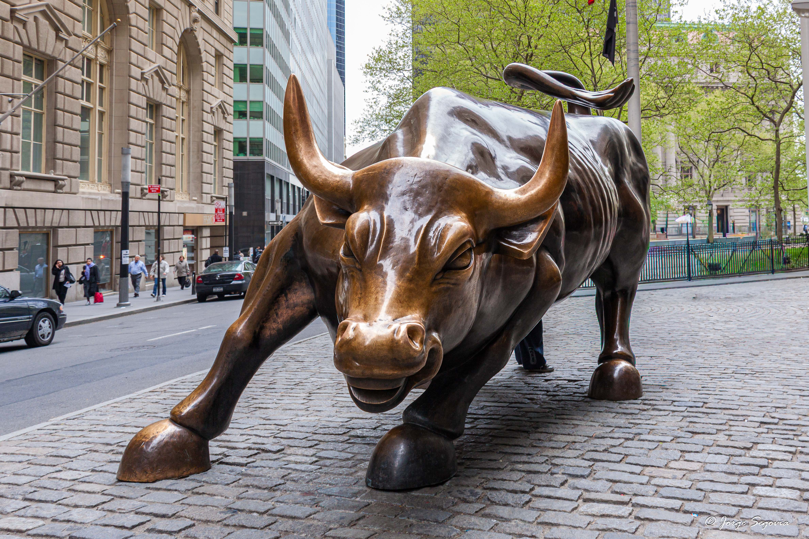

**Charging Bull: El corazón de bronce que nunca duerme**

Si visitas **Nueva York**, hay una parada obligatoria en el **Distrito Financiero** que representa mucho más que una simple escultura: el *Charging Bull*. Este coloso de bronce de más de 3 toneladas, ubicado en la histórica plaza de **Bowling Green**, es el símbolo máximo del optimismo y la fuerza del mercado estadounidense.

Lo que muchos no saben es que su origen fue un acto de rebeldía. El artista **Arturo Di Modica** lo instaló ilegalmente frente a la Bolsa en 1989 como un regalo de Navidad tras la crisis financiera, buscando inspirar a los neoyorquinos a “embestir” contra la adversidad. Hoy, es uno de los puntos más fotografiados del mundo.

